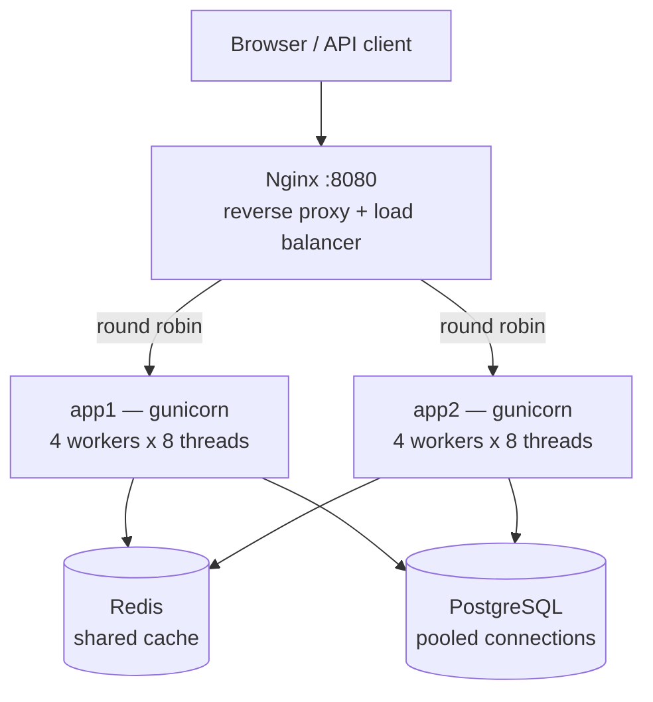
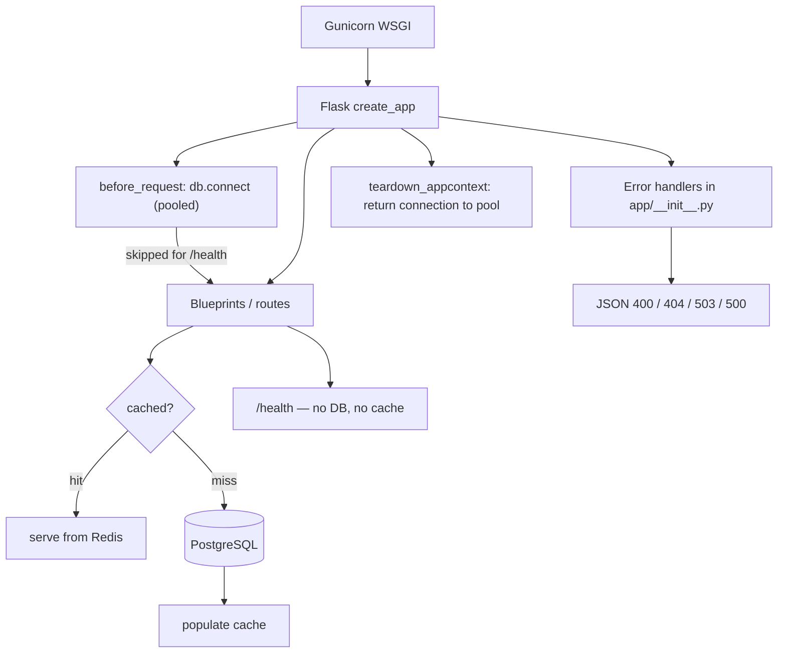

# Architecture overview

High-level view of how requests move through the app and where errors are handled.

## System diagram

## Deployed topology

What `docker compose up` actually runs. Only Nginx is reachable from outside.

Both app instances share one Redis, so a value cached by `app1` is a hit on
`app2`. Nginx ejects an instance from the pool after 2 failed attempts and
retries idempotent requests against the survivor.

## Request flow within an instance

A cache outage is not an outage: `@cache.cached` falls back to calling the
view when the backend raises, so every read path falls through to Postgres.

## Key files

| File | Role |
|------|------|
| `run.py` | WSGI entry point (`gunicorn run:app`) |
| `app/__init__.py` | App factory + global error handlers + stale-connection eviction |
| `app/database.py` | Pooled Postgres connections, per-request checkout/return |
| `app/cache.py` | Cache backend selection (Redis / in-process / disabled) |
| `app/routes/urls.py` | URL CRUD, redirect, pagination, cached routes |
| `docker-compose.yml` | 2 app instances + Nginx + Postgres + Redis |
| `nginx.conf` | Load balancing, upstream health, failover |
| `chaos/chaos_test.sh` | Fault injection and recovery evidence |
| `loadtest/locustfile.py` | Three load profiles (tier-comparable, realistic, saturation) |
| `app/observability.py` | Structured logging + Prometheus `/metrics` |
| `app/alerting.py` | Alertmanager → Discord/Slack message formatting |
| `scripts/health_watch.py` | Health poll + webhook alert |
| `scripts/alert_webhook_bridge.py` | Alertmanager receiver |
| `scripts/demo_incident.sh` | Trigger + recover demo for judges |
| `monitoring/` | Prometheus, Alertmanager, Grafana, alert rules |
| `docs/incident-response.md` | IR tier checklist + diagnosis walkthrough |
| `docs/runbooks.md` | Per-alert response playbooks |

## Related docs

- [performance.md](performance.md) — bottleneck analysis, cache A/B, where the ceiling is
- [load-testing.md](load-testing.md) — load test setup and per-tier results
- [failure-modes.md](failure-modes.md) — what breaks, status codes, chaos results
- [incident-response.md](incident-response.md) — IR Bronze/Silver/Gold checklist
- [runbooks.md](runbooks.md) — alert response playbooks
- [observability.md](observability.md) — logs, metrics, monitoring stack
- [coverage-gaps-for-person-1.md](coverage-gaps-for-person-1.md) — coverage state
