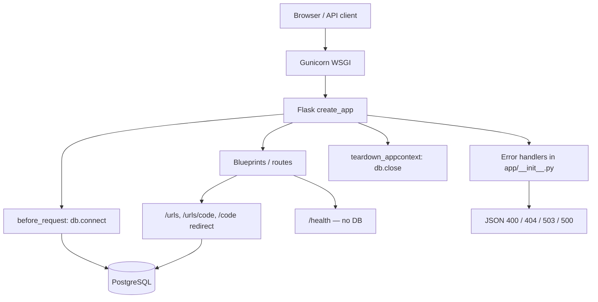

# Architecture overview

High-level view of how requests move through the app and where errors are handled.

## System diagram

## Key files

| File | Role |
|------|------|
| `run.py` | WSGI entry point (`gunicorn run:app`) |
| `app/__init__.py` | App factory + global error handlers |
| `app/database.py` | Postgres connection, per-request connect/close |
| `app/routes/urls.py` | URL CRUD and redirect routes |
| `tests/conftest.py` | SQLite test DB (no live Postgres needed) |

## Related docs

- [failure-modes.md](failure-modes.md) — what breaks, status codes, chaos/CI diagrams
- [coverage-gaps-for-person-1.md](coverage-gaps-for-person-1.md) — untested paths and suggested tests
