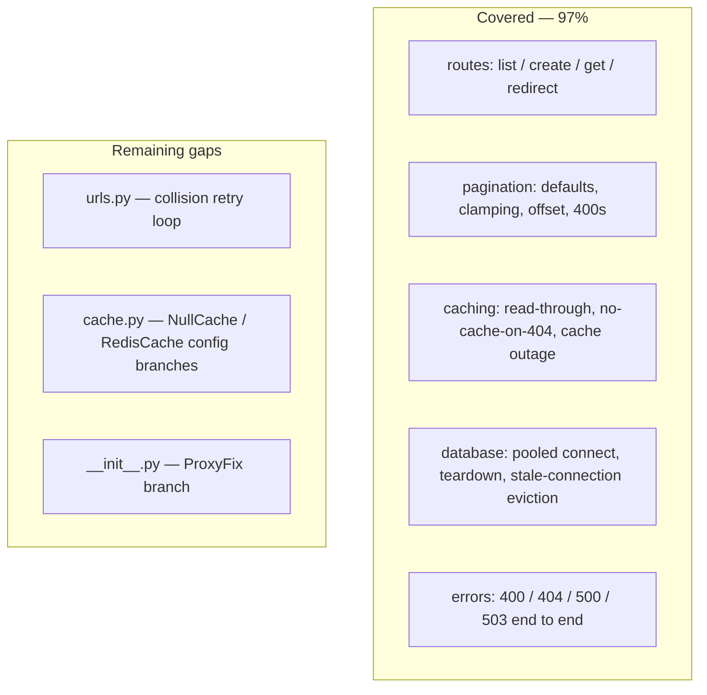

# Test coverage: current state and remaining gaps

Generated from `uv run pytest --cov=app --cov-report=term-missing`.

**34 tests, 97% coverage** (roadmap targets: 50% for Silver, 70% for Gold).

| Module | Coverage | Uncovered |
|---|---|---|
| `app/database.py` | 100% | — |
| `app/models/*` | 100% | — |
| `app/routes/__init__.py` | 100% | — |
| `app/__init__.py` | 98% | the `ProxyFix` branch |
| `app/routes/urls.py` | 95% | short-code collision retry loop |
| `app/cache.py` | 85% | two config branches (13 statements total) |

## Suite layout

| Directory | Scope |
|---|---|
| `tests/unit/` | One layer in isolation: model constraints and `/health` |
| `tests/integration/` | Full request → route → DB → response: URL CRUD, pagination, caching behaviour, every documented error path |



## Remaining gaps, and why they are acceptable

- **`app/routes/urls.py` — the `IntegrityError` collision retry loop.**
  A duplicate `short_code` retries up to 5 times, then returns 503. Reaching
  it means forcing a collision, e.g. patching `_new_code` to return a
  constant. Worth adding: the path is real, if astronomically unlikely at
  62^6 possible codes.

- **`app/cache.py` — the `NullCache` and `RedisCache` config branches.**
  The suite deliberately runs on `SimpleCache` so it needs no Redis server,
  so only the `else` branch executes. Both other branches are exercised for
  real by the Docker stack.

- **`app/__init__.py` — the `ProxyFix` branch.** Only taken when
  `TRUST_PROXY_HEADERS` is set, which the Docker stack does and the test
  suite does not.

## Re-running

```bash
uv run pytest --cov=app --cov-report=term-missing
```
