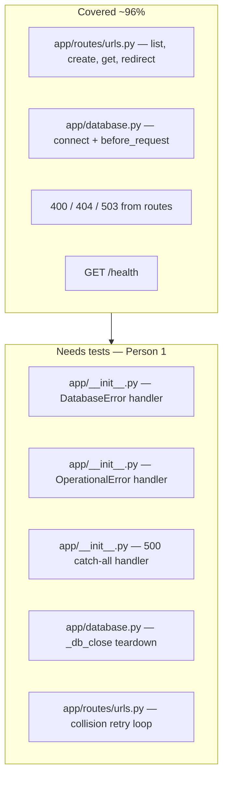
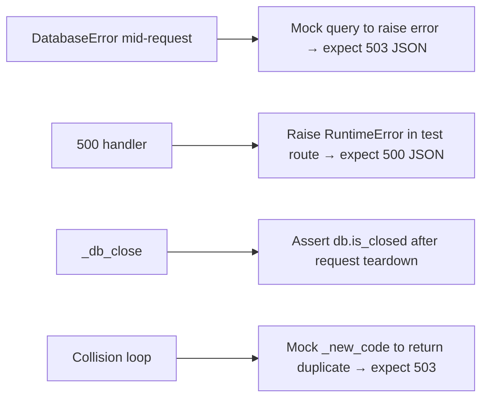

# Coverage gaps for Person 1

Generated from `uv run pytest --cov=app --cov-report=term-missing` (96% overall).

## Coverage map



## Untested paths

Please add tests for the following:

- **`app/__init__.py` — `handle_database_error` / `handle_operational_error` (lines 39, 43)** — Global Peewee `DatabaseError` and `OperationalError` handlers during a request. Matters because mid-request DB failures should return 503 JSON, not a crash.

- **`app/__init__.py` — `handle_internal_server_error` (line 47)** — Catch-all 500 handler. Matters because unexpected exceptions must return JSON `{ "error": "internal_server_error" }`, not an HTML stack trace.

- **`app/database.py` — `_db_close` (line 38)** — Teardown closes the DB connection after each request. Matters for connection leaks under load or after errors.

- **`app/routes/urls.py` — `create_url` retry loop (lines 59–62)** — `IntegrityError` on duplicate `short_code` retries up to 5 times, then returns **503**. Matters because collision handling is a real failure mode under traffic.

## Suggested test approach



Run coverage after adding tests:

```bash
uv run pytest --cov=app --cov-report=term-missing
```
