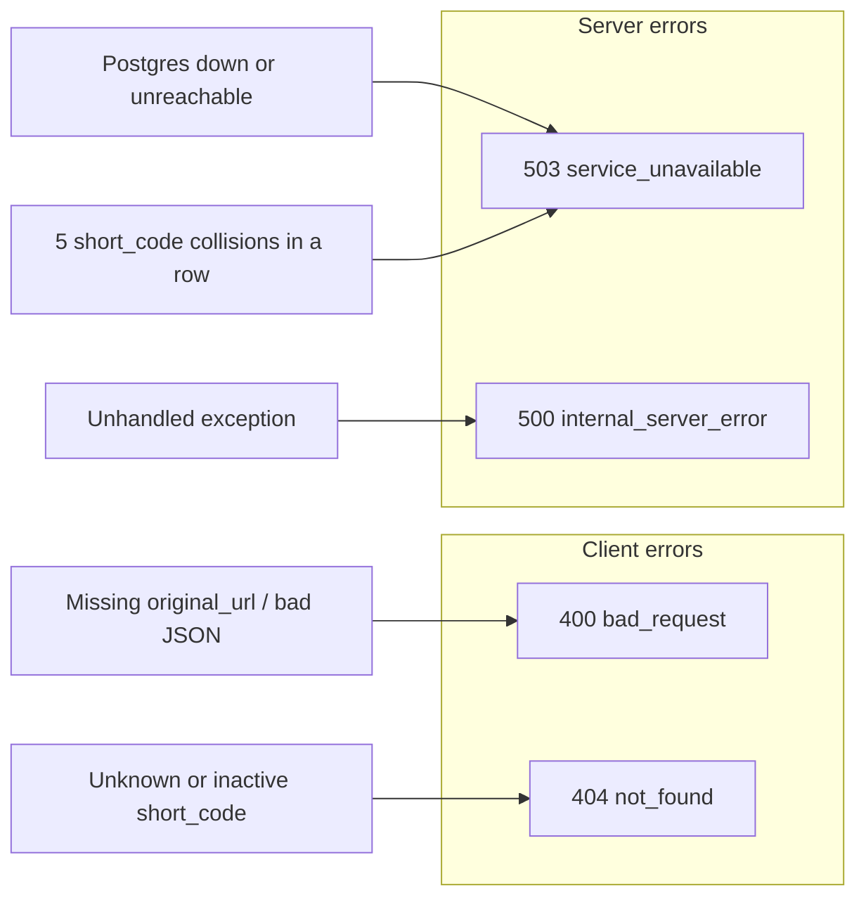
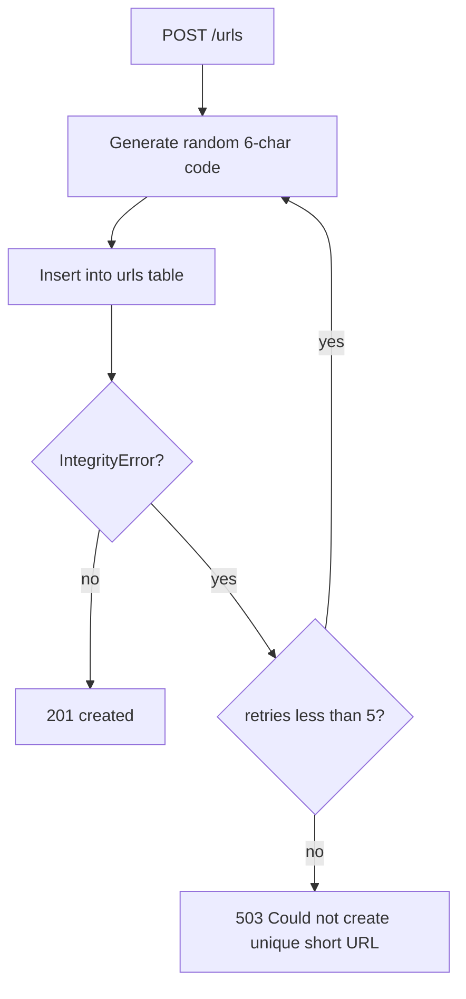
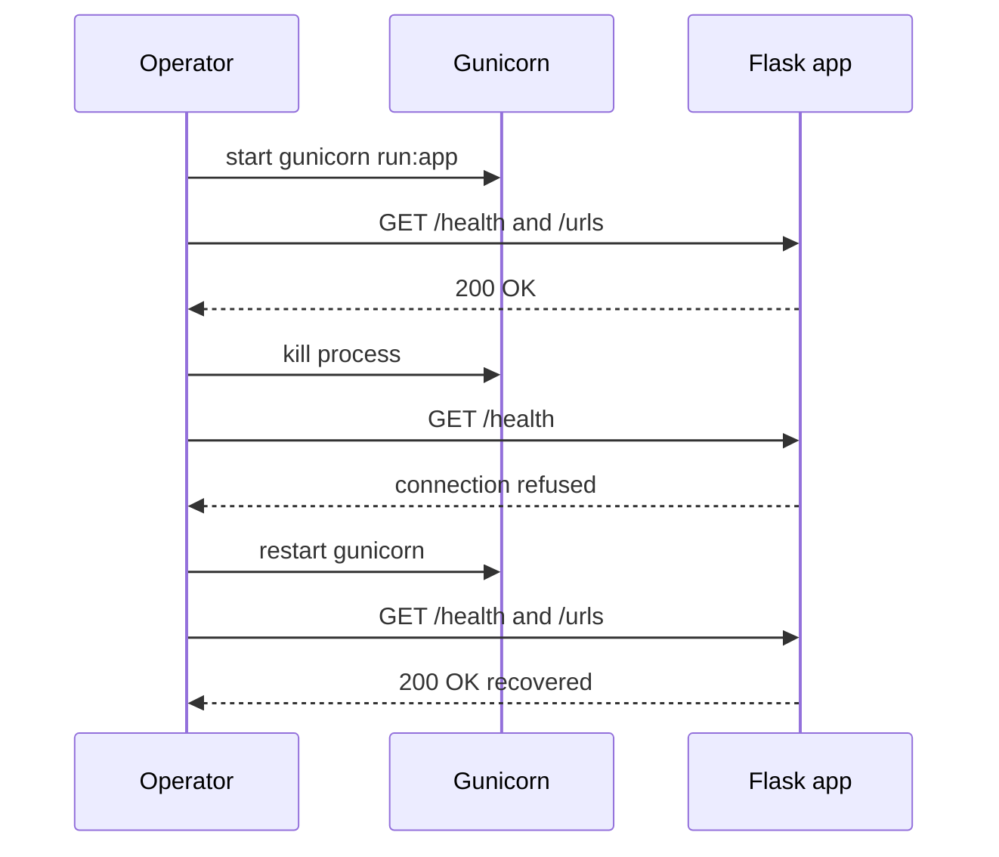
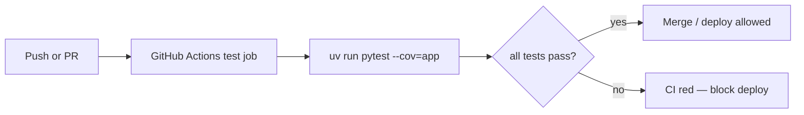

# Failure modes

Each scenario documents what can break, what the user sees, and how it was tested.

## Request flow

```mermaid
flowchart TD
    Client[Client request] --> Flask[Flask app]
    Flask --> HealthCheck{endpoint is /health?}
    HealthCheck -->|yes| HealthOK["200 JSON status ok"]
    HealthCheck -->|no| DbConnect[before_request: db.connect]
    DbConnect --> DbFail{connect ok?}
    DbFail -->|no| S503a["503 service_unavailable"]
    DbFail -->|yes| Route[Route handler]
    Route --> Valid{input valid?}
    Valid -->|no| A400["400 bad_request"]
    Valid -->|yes| Found{resource found?}
    Found -->|no| A404["404 not_found"]
    Found -->|yes| Success["200 / 201 / 302"]
    Route --> DbErr{DatabaseError?}
    DbErr -->|yes| S503b["503 service_unavailable"]
    Route --> Unhandled{unhandled exception?}
    Unhandled -->|yes| A500["500 internal_server_error"]
    Success --> Teardown[teardown: db.close]
    A400 --> Teardown
    A404 --> Teardown
    S503a --> Teardown
    S503b --> Teardown
    A500 --> Teardown
```



## Error response map



All error responses use the same JSON shape:

```json
{ "error": "<code>", "message": "<human-readable detail>" }
```

---

## Invalid POST body

| Field | Detail |
|-------|--------|
| **What can break** | Client sends empty body, non-JSON, or JSON without `original_url` |
| **What the user sees** | `400` — `{ "error": "bad_request", "message": "original_url is required" }` |
| **How it was tested** | `tests/unit/test_errors.py::test_create_url_missing_body_returns_400`, `test_create_url_no_json_returns_400` |

## Unknown short code (lookup)

| Field | Detail |
|-------|--------|
| **What can break** | Client requests a `short_code` that does not exist |
| **What the user sees** | `404` — `{ "error": "not_found", "message": "Short URL not found" }` |
| **How it was tested** | `tests/unit/test_errors.py::test_get_unknown_url_returns_404` |

## Unknown or inactive redirect

| Field | Detail |
|-------|--------|
| **What can break** | Redirect target missing, or URL exists but `is_active` is false |
| **What the user sees** | `404` — `{ "error": "not_found", "message": "Short URL not found" }` |
| **How it was tested** | `tests/unit/test_errors.py::test_redirect_unknown_code_returns_404`, `test_redirect_inactive_url_returns_404` |

## Database unavailable

| Field | Detail |
|-------|--------|
| **What can break** | Postgres is down or unreachable when a DB-backed route runs |
| **What the user sees** | `503` — `{ "error": "service_unavailable", "message": "Database unavailable" }` |
| **How it was tested** | `tests/unit/test_errors.py::test_database_unavailable_returns_503` (mocks `db.connect` to raise `OperationalError`) |

## Health check during DB outage

| Field | Detail |
|-------|--------|
| **What can break** | Postgres is down but load balancer probes `/health` |
| **What the user sees** | `200` — `{ "status": "ok" }` (health skips DB connect) |
| **How it was tested** | `tests/unit/test_errors.py::test_health_ok_without_database` |

## Short code collision exhaustion

| Field | Detail |
|-------|--------|
| **What can break** | Random 6-char code collides 5 times in a row on insert |
| **What the user sees** | `503` — `{ "error": "service_unavailable", "message": "Could not create a unique short URL" }` |
| **How it was tested** | Not yet covered — see [coverage-gaps-for-person-1.md](coverage-gaps-for-person-1.md) |



## Process crash / restart

| Field | Detail |
|-------|--------|
| **What can break** | Gunicorn worker or process is killed mid-request |
| **What the user sees** | In-flight request may fail; after restart, `/health` and API routes respond normally |
| **How it was tested** | Manual chaos test (see below) |

### Chaos recovery sequence



### Chaos test steps

```bash
# 1. Start the server (same as Procfile)
uv run gunicorn run:app --bind 127.0.0.1:5000 --daemon --pid /tmp/pe-gunicorn.pid

# 2. Verify it works
curl -s http://127.0.0.1:5000/health
curl -s http://127.0.0.1:5000/urls

# 3. Kill the process
kill $(cat /tmp/pe-gunicorn.pid)

# 4. Confirm it is down (connection refused)
curl -s http://127.0.0.1:5000/health || echo "down"

# 5. Restart
uv run gunicorn run:app --bind 127.0.0.1:5000 --daemon --pid /tmp/pe-gunicorn.pid

# 6. Verify recovery
curl -s http://127.0.0.1:5000/health
curl -s http://127.0.0.1:5000/urls
```

Expected after restart: `/health` returns `{"status":"ok"}` and `/urls` returns `200` with a JSON array.

**Result (2026-07-24):** After seeding the database, kill + restart recovered successfully — `/health` returned 200 and `/urls` returned 200 with JSON before and after restart.

## CI gate

| Field | Detail |
|-------|--------|
| **What can break** | Tests fail on push or pull request |
| **What the user sees** | GitHub Actions CI job fails; deployment must not proceed |
| **How it was tested** | `.github/workflows/ci.yml` runs `uv run pytest --cov=app`. Enable **Require status checks to pass** for the `test` job in branch protection to block deploys on failure. |


