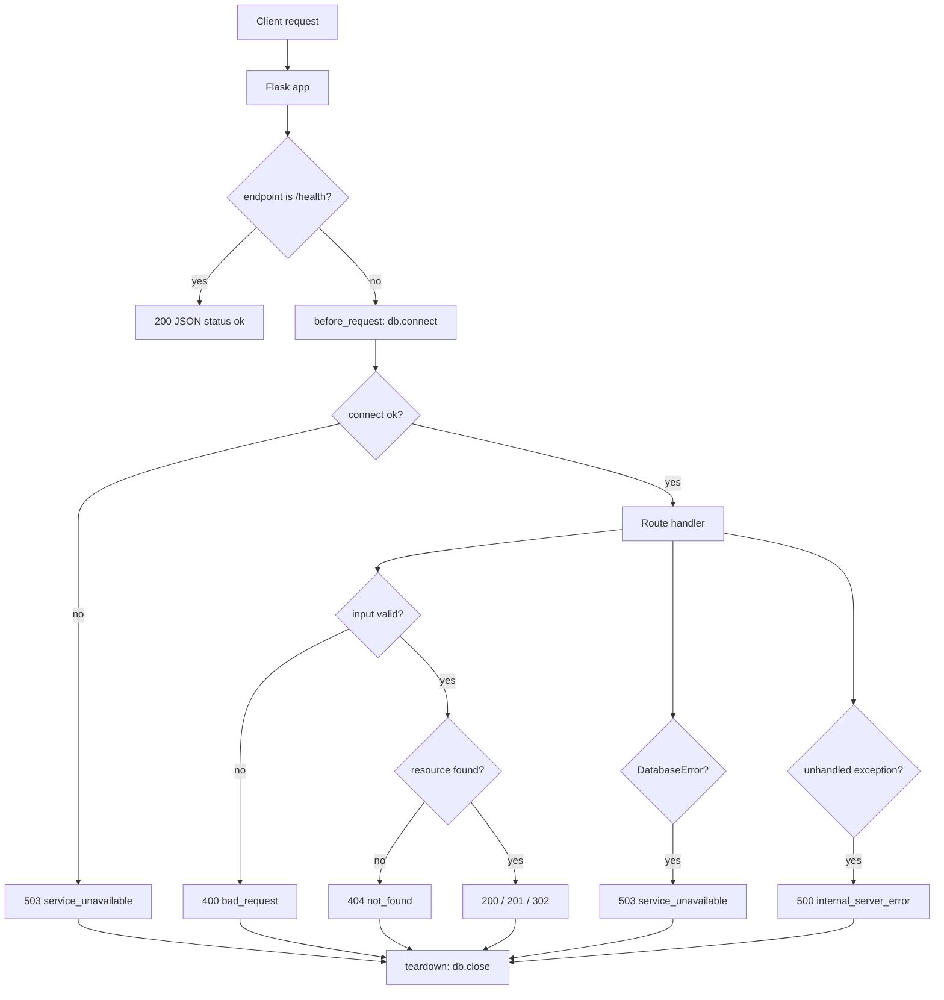
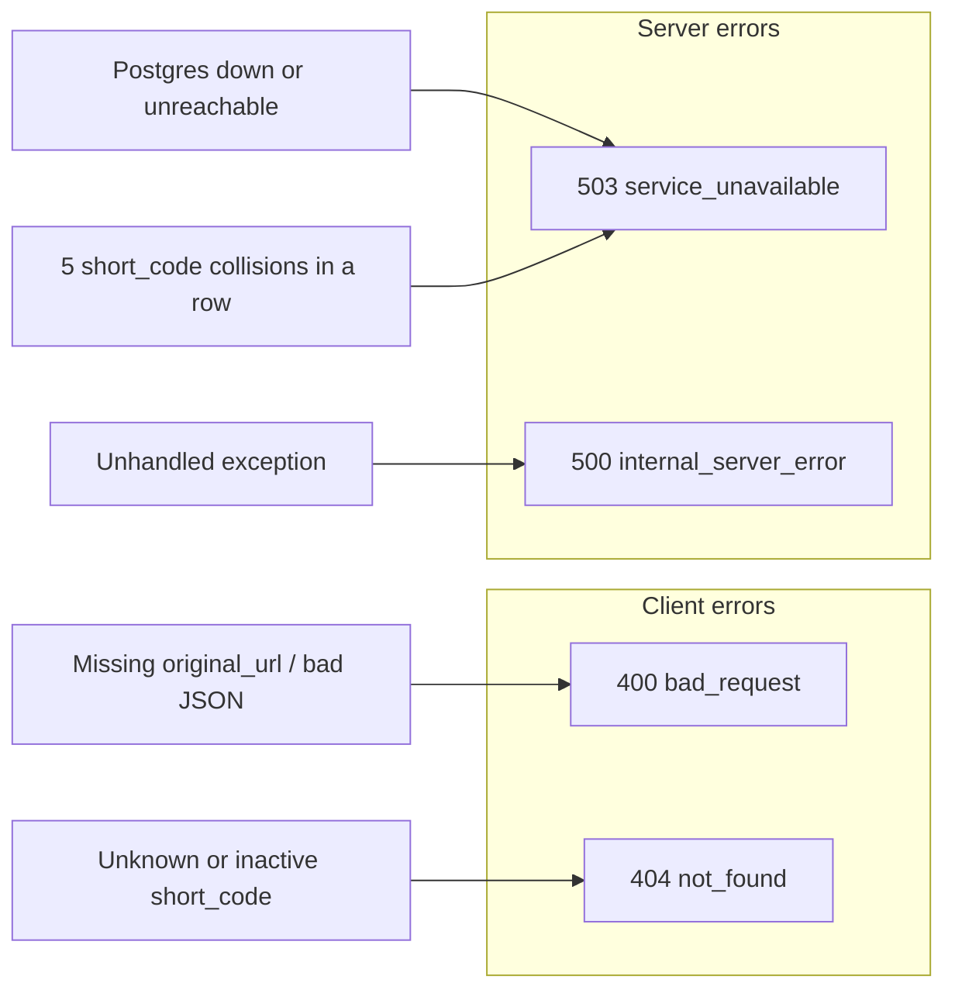
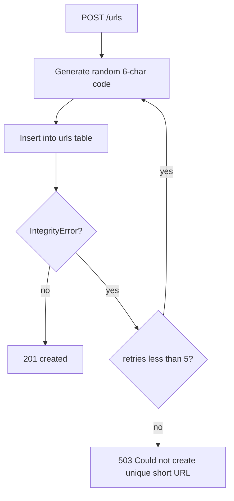
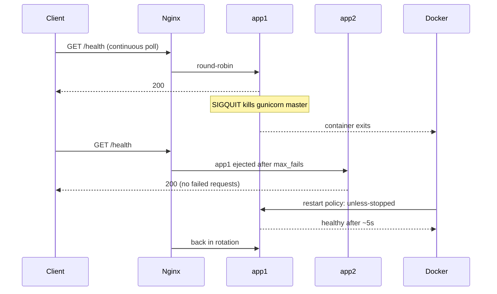
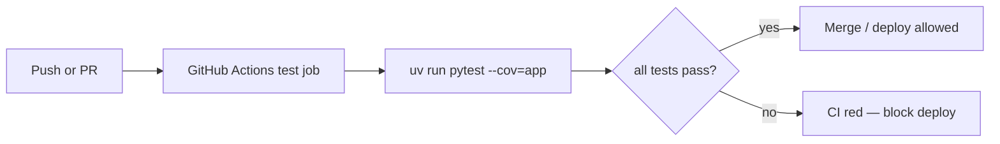

# Failure modes

Each scenario documents what can break, what the user sees, and how it was tested.

## Request flow



## Error response map



All error responses use the same JSON shape:

```json
{ "error": "<code>", "message": "<human-readable detail>" }
```

---

## Invalid POST body

| Field | Detail |
|-------|--------|
| **What can break** | Client sends empty body, non-JSON, or JSON without `original_url` |
| **What the user sees** | `400` — `{ "error": "bad_request", "message": "original_url is required" }` |
| **How it was tested** | `tests/integration/test_error_handling.py::test_create_url_missing_body_returns_400`, `test_create_url_no_json_returns_400` |

## Unknown short code (lookup)

| Field | Detail |
|-------|--------|
| **What can break** | Client requests a `short_code` that does not exist |
| **What the user sees** | `404` — `{ "error": "not_found", "message": "Short URL not found" }` |
| **How it was tested** | `tests/integration/test_error_handling.py::test_get_unknown_url_returns_404` |

## Unknown or inactive redirect

| Field | Detail |
|-------|--------|
| **What can break** | Redirect target missing, or URL exists but `is_active` is false |
| **What the user sees** | `404` — `{ "error": "not_found", "message": "Short URL not found" }` |
| **How it was tested** | `tests/integration/test_error_handling.py::test_redirect_unknown_code_returns_404`, `test_redirect_inactive_url_returns_404` |

## Database unavailable

| Field | Detail |
|-------|--------|
| **What can break** | Postgres is down or unreachable when a DB-backed route runs |
| **What the user sees** | `503` — `{ "error": "service_unavailable", "message": "Database unavailable" }` |
| **How it was tested** | `tests/integration/test_error_handling.py::test_database_unavailable_returns_503` (mocks `db.connect` to raise `OperationalError`) |

## Health check during DB outage

| Field | Detail |
|-------|--------|
| **What can break** | Postgres is down but load balancer probes `/health` |
| **What the user sees** | `200` — `{ "status": "ok" }` (health skips DB connect) |
| **How it was tested** | `tests/integration/test_error_handling.py::test_health_ok_without_database` |

## Short code collision exhaustion

| Field | Detail |
|-------|--------|
| **What can break** | Random 6-char code collides 5 times in a row on insert |
| **What the user sees** | `503` — `{ "error": "service_unavailable", "message": "Could not create a unique short URL" }` |
| **How it was tested** | Not yet covered — see [coverage-gaps-for-person-1.md](coverage-gaps-for-person-1.md) |



## Process crash / restart

| Field | Detail |
|-------|--------|
| **What can break** | The gunicorn master dies, or a container is killed |
| **What the user sees** | Nothing, if more than one instance is running — Nginx routes to the survivor while Docker restarts the dead instance |
| **How it was tested** | Automated chaos test, Scenario A — see [Chaos testing](#chaos-testing) |

## Gunicorn worker death

| Field | Detail |
|-------|--------|
| **What can break** | A single gunicorn worker is killed (OOM, segfault, manual kill) |
| **What the user sees** | Nothing — the master respawns the worker; the container never exits |
| **How it was tested** | Automated chaos test, Scenario C |

## Cache (Redis) unavailable

| Field | Detail |
|-------|--------|
| **What can break** | Redis is down or unreachable |
| **What the user sees** | Correct responses, slightly slower — every read falls through to Postgres |
| **How it was tested** | Automated chaos test, Scenario D; and `tests/integration/test_caching.py::test_cache_outage_degrades_to_the_database` |

The cache is an optimisation, never a source of truth. Flask-Caching's `@cache.cached` decorator falls back to calling the view when the backend raises, so a cache outage costs latency rather than availability — provided debug mode is off (see below).

## Stale pooled database connections

| Field | Detail |
|-------|--------|
| **What can break** | Postgres restarts while the app holds pooled connections to it. The handles survive client-side but their server is gone |
| **What the user sees** | Previously: one `503` per dead connection. Now: nothing — the first error evicts every idle connection so the pool refills with live ones |
| **How it was tested** | `docker compose restart postgres` with a warm pool of 47 connections, then 30 consecutive requests — 30/30 returned 200. Before the fix the same test returned `503 503 200 200 ...` |

Fixed by calling `db.close_idle()` from the `OperationalError`/`InterfaceError` handler in [app/__init__.py](../app/__init__.py). `close_idle()` and not `close_all()`, because in-use connections belong to other in-flight requests. Detail in [performance.md](performance.md#stale-pooled-connections-found-by-chaos-testing).

## Seeded ids desynchronise the Postgres sequence

| Field | Detail |
|-------|--------|
| **What can break** | The seed CSVs supply explicit `id` values, and Postgres does not advance a serial sequence for rows that bring their own id |
| **What the user sees** | Previously: every `POST /urls` returned `503` on a freshly seeded database until the sequence burned past the seeded ids. Now: nothing |
| **How it was tested** | Seed a clean database, then POST. Before the fix: `503 503 503`. After: `201 201 201`, with `sequence_at` matching `max(id)` |

`sync_sequence()` in [seed.py](../seed.py) calls `setval` on each table's sequence after loading. Found by load testing — and it nearly escaped, because 400 failing POSTs among 173,000 requests is 0.23% overall, well inside the 5% error budget, while 11% of POSTs were failing. The load test thresholds now check per endpoint as well as in aggregate.

## Debug mode turns a cache blip into a 500

| Field | Detail |
|-------|--------|
| **What can break** | Flask-Caching only swallows backend errors when `app.debug` is False. In debug mode it re-raises, so an unreachable Redis becomes a `500` instead of a fallback to Postgres |
| **What the user sees** | With debug off (the deployed configuration): correct responses served from Postgres. With debug on: `500` on cached routes |
| **How it was tested** | Chaos Scenario D, plus `tests/integration/test_caching.py::test_cache_outage_degrades_to_the_database`, which pins `DEBUG=False` |

This bit us for real: there was no `.dockerignore`, so `COPY . .` baked the developer's local `.env` — including `FLASK_DEBUG=true` — into the image, and every container ran with debug on. [.dockerignore](../.dockerignore) fixes it. Debug must be off in production regardless; the Werkzeug debugger allows remote code execution.

## Chaos testing

[chaos/chaos_test.sh](../chaos/chaos_test.sh) runs four failure scenarios against the Docker Compose stack and prints a timestamped transcript. The committed output of the most recent run is [chaos/results/chaos-run.log](../chaos/results/chaos-run.log).

```bash
docker compose up -d --build
docker compose exec -T app1 uv run seed.py
# Wait until `docker compose ps` shows app1 and app2 healthy.
./chaos/chaos_test.sh 2>&1 | tee chaos/results/chaos-run.log
```

Each scenario runs a background poller against the load balancer every 0.2s and reports how many requests failed while the fault was active.

### Results (2026-07-30)


| # | Fault injected | Expected | Observed |
|---|---|---|---|
| **A** | `kill -QUIT 1` inside `app1` (kills the gunicorn master) | LB serves from `app2`; Docker restarts `app1` | `RestartCount` 0 -> 1, healthy again after ~5s, **41/41 polled requests returned 200** |
| **B** | `docker compose stop postgres` | `503` JSON on DB routes, `/health` stays `200`, no crash | `GET /urls` -> `503 service_unavailable`, `/health` -> `200`, both containers stayed up, recovered ~2s after restart |
| **C** | `kill -9` a gunicorn worker | Master respawns it, no requests lost | 5 gunicorn processes before and after, container never exited, **39/39 polled requests returned 200** |
| **D** | `docker compose stop redis` | Reads fall through to Postgres | redirect -> `302`, `/urls` -> `200`, `/urls/<code>` -> `200`, `POST /urls` -> `201`, **18/18 polled requests returned 200**, recovered ~6s |

### Chaos recovery sequence (Scenario A)



### Two things worth knowing before an incident

Both were discovered the hard way while building this test, and both make a chaos test silently pass while proving nothing:

1. **`kill` is a shell builtin, not an executable.** `docker compose exec app1 kill -9 1` fails with `executable file not found in $PATH`. It has to go through `sh -c`.
2. **SIGKILL is not delivered to PID 1 from inside its own PID namespace.** The kernel shields a namespace's init process from signals sent by its own members unless a handler is installed, so `kill -9 1` inside a container does *nothing*. SIGQUIT works because gunicorn installs a handler for it. To kill PID 1 outright you have to signal from outside, with `docker kill`.

Related: `docker kill` and `docker stop` both mark a container as manually stopped, so `restart: unless-stopped` will *not* bring it back. Verified — `docker kill` left `RestartCount` at 0. The restart policy fires when the process dies on its own, which is what Scenario A does.

## CI gate

| Field | Detail |
|-------|--------|
| **What can break** | Tests fail on push or pull request |
| **What the user sees** | GitHub Actions CI job fails; deployment must not proceed |
| **How it was tested** | `.github/workflows/ci.yml` runs `uv run pytest --cov=app`. Enable **Require status checks to pass** for the `test` job in branch protection to block deploys on failure. |


