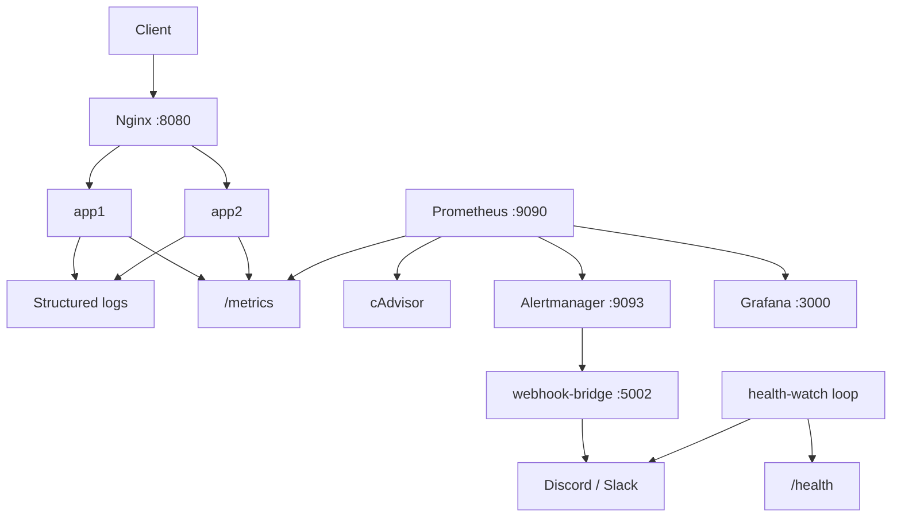

# Incident Response roadmap — complete

This project implements all three Incident Response tiers from the hackathon guide.

## Tier checklist

| Tier | Points | Requirements | Status |
|------|--------|--------------|--------|
| **Bronze — Visible** | 10 | Structured logging, basic metrics, manual status checks | Done |
| **Silver — Alert Me** | 25 | Webhook alerts, health + resource thresholds, fire within 5 min | Done |
| **Gold — Incident Ready** | 50 | Grafana dashboard (4+ metrics), runbooks, diagnosis demo | Done |

## Architecture



## Bronze: Visible

| Capability | Where |
|------------|-------|
| Structured logging | `app/observability.py` — timestamp, level, method, path, status, duration |
| Request + error metrics | `/metrics` via prometheus-flask-exporter + custom counters |
| Manual status checks | `curl /health`, `curl /metrics`, `docker compose ps`, `docker compose logs` |

Details: [observability.md](observability.md)

## Silver: Alert Me

| Capability | Where |
|------------|-------|
| Alert routing | Prometheus → Alertmanager → `scripts/alert_webhook_bridge.py` → `ALERT_WEBHOOK_URL` |
| Service down | `ShortenerDown` rule (`up{job="shortener"} == 0`, 1 min) |
| Error rate | `HighErrorRate` (5xx > 5%, 2 min), `HighClientErrorRate` (4xx > 20%) |
| CPU / memory | `HighAppCPU`, `HighAppMemory` from cAdvisor container metrics |
| Backup health poll | `health-watch` service — polls `/health` every 60 s |

### Start the monitoring stack

```bash
cp .env.example .env
# Add: ALERT_WEBHOOK_URL=https://discord.com/api/webhooks/...

docker compose --profile monitoring up -d --build
```

| Service | URL |
|---------|-----|
| App (via LB) | http://localhost:8080 |
| Prometheus | http://localhost:9090 |
| Alertmanager | http://localhost:9093 |
| Grafana | http://localhost:3000 (admin / admin) |
| cAdvisor | http://localhost:8081 |

### Test an alert (evidence for judges)

```bash
# Stop the app tier — ShortenerDown fires within ~1 min, health-watch within 60 s
docker compose stop app1 app2

# Watch Alertmanager
open http://localhost:9093

# Check Discord/Slack for webhook message

# Recover
docker compose start app1 app2
```

Scripted demo: [`scripts/demo_incident.sh`](../scripts/demo_incident.sh)

## Gold: Incident Ready

### Dashboard (6 panels — 4+ required)

Grafana dashboard **URL Shortener — Incident Response** (`monitoring/grafana/dashboards/shortener-incident.json`):

1. **Request rate** — requests per second
2. **Error rate (5xx)** — failure ratio
3. **Response latency p95** — golden signal
4. **App CPU** — container saturation
5. **App memory** — container RSS
6. **Scrape health** — up/down stat

### Runbooks

Alert-specific response steps: [runbooks.md](runbooks.md)

### Diagnosis walkthrough (demo script)

**Scenario:** Error rate spiked after Postgres stopped.

1. **Alert fires** — `HighErrorRate` or `ShortenerDown` in Alertmanager; webhook received.
2. **Open Grafana** — error rate panel rising; p95 latency may spike; scrape health may drop.
3. **Check logs:**
   ```bash
   docker compose logs app1 | rg "status=503|Database unavailable"
   ```
4. **Root cause:** Postgres down — confirm with `docker compose ps postgres`.
5. **Fix:** `docker compose start postgres` — apps recover in ~2 s (see chaos Scenario B in [failure-modes.md](failure-modes.md)).
6. **Verify:** Grafana error rate returns to 0; Alertmanager alert resolves.

## Related docs

- [observability.md](observability.md) — logs, metrics, quick commands
- [runbooks.md](runbooks.md) — per-alert playbooks
- [failure-modes.md](failure-modes.md) — application failure catalogue
- [architecture.md](architecture.md) — system topology
