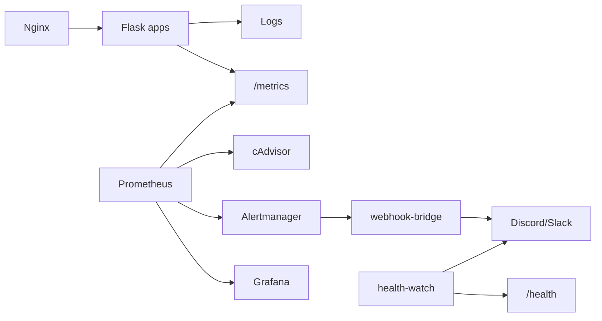

# Observability & Incident Response

Full implementation guide: [incident-response.md](incident-response.md)  
Alert playbooks: [runbooks.md](runbooks.md)

## Bronze — manual status checks

```bash
# Liveness (no database)
curl -s http://localhost:8080/health

# Prometheus metrics
curl -s http://localhost:8080/metrics | head -20

# Container state
docker compose ps
docker compose logs -f app1
```

## Structured logging

Every request logs (from `app/observability.py`):

```text
2026-07-25T03:00:00+0000 INFO app request method=GET path=/health endpoint=health status=200 duration_ms=0.42
```

## Metrics (4+ golden signals)

| Metric | Source |
|--------|--------|
| Request rate | `flask_http_request_total` |
| Error rate | 4xx/5xx ratio from `flask_http_request_total` |
| Latency p95 | `flask_http_request_duration_seconds_bucket` |
| CPU / memory | cAdvisor `container_*` metrics |
| Custom counters | `shortener_app_requests_total`, `shortener_app_errors_total` |

## Silver — alerting stack

```bash
# Set Discord/Slack webhook in .env
ALERT_WEBHOOK_URL=https://discord.com/api/webhooks/...

docker compose --profile monitoring up -d --build
```

| Service | Port | Role |
|---------|------|------|
| Prometheus | 9090 | Scrapes `/metrics` + cAdvisor; evaluates alert rules |
| Alertmanager | 9093 | Routes firing alerts to webhook bridge |
| webhook-bridge | 5002 | Formats alerts for Discord/Slack |
| health-watch | — | Polls `/health` every 60 s (backup alert path) |
| cAdvisor | 8081 | Container CPU/memory metrics |

**Alert rules:** `monitoring/alert_rules.yml` — service down, 5xx rate, 4xx rate, high CPU, high memory.

**Test alerts:**

```bash
chmod +x scripts/demo_incident.sh
./scripts/demo_incident.sh
```

## Gold — Grafana dashboard

- URL: http://localhost:3000 (admin / admin)
- Dashboard: **URL Shortener — Incident Response**
- Provisioned from `monitoring/grafana/dashboards/shortener-incident.json`

## Architecture


