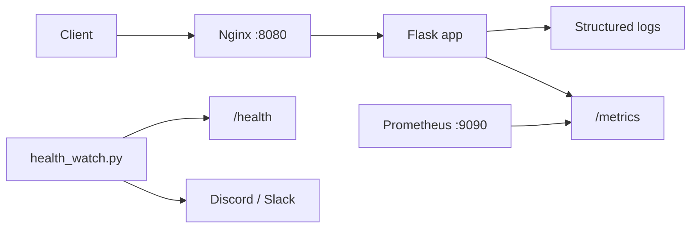

# Observability (Incident Response)

Bronze visibility: structured logs, Prometheus metrics, and manual status checks.

## Quick status checks

```bash
# Liveness (no database required)
curl -s http://localhost:8080/health
# → {"status":"ok"}

# Prometheus metrics (request counts, latency, errors)
curl -s http://localhost:8080/metrics | head

# Container health (Docker Compose)
docker compose ps
docker compose logs -f app1
```

## Structured logging

Configured in [`app/observability.py`](../app/observability.py). Every request logs:

```text
2026-07-25T03:00:00+0000 INFO app request method=GET path=/health endpoint=health status=200 duration_ms=0.42
```

Fields: timestamp, level, logger name, HTTP method, path, Flask endpoint, status code, duration.

View logs:

```bash
# Local dev
uv run run.py

# Docker stack
docker compose logs -f app1 app2 nginx
```

## Metrics collected

| Metric | Source | Purpose |
|--------|--------|---------|
| `flask_http_request_*` | prometheus-flask-exporter | Request count, latency, in-progress |
| `shortener_app_requests_total` | custom counter | Per-endpoint status breakdown |
| `shortener_app_errors_total` | custom counter | 4xx/5xx totals |

`/metrics` skips the database connection so scrapes succeed during a Postgres outage.

## Prometheus (Silver starter)

With the full stack running:

```bash
docker compose --profile monitoring up -d
open http://localhost:9090
```

Prometheus scrapes `nginx:80/metrics` every 15s. Alert rules live in [`monitoring/alert_rules.yml`](../monitoring/alert_rules.yml).

## Health watch + webhook alert

Simple alert script (no Prometheus required):

```bash
export ALERT_WEBHOOK_URL="https://discord.com/api/webhooks/..."
uv run python scripts/health_watch.py --url http://localhost:8080/health
```

Returns exit code 1 and posts to the webhook when `/health` fails. Run from cron or a CI scheduled job to meet the “alert within 5 minutes” Silver bar.

## Architecture



## Related docs

- [failure-modes.md](failure-modes.md) — Reliability Gold failure catalogue
- [architecture.md](architecture.md) — system components
