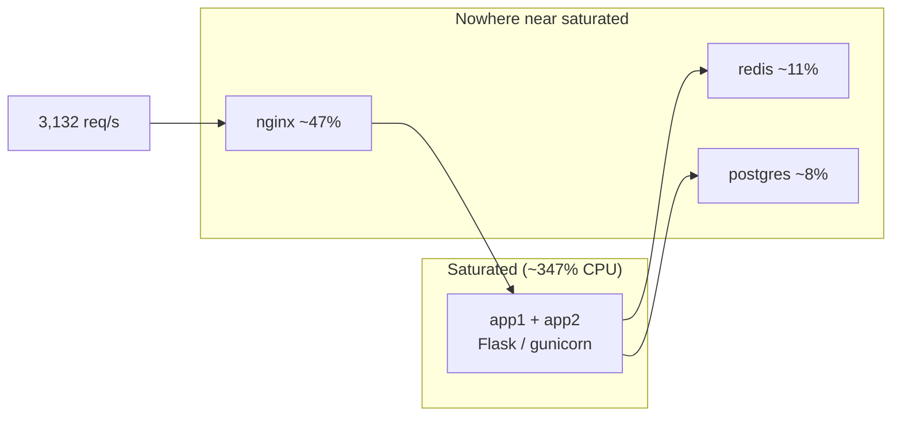

# Performance: bottlenecks, caching, and where the ceiling actually is

The Scalability Gold write-up: what was slow, what we changed, what it bought,
and where the limit actually sits once the obvious problem is gone.

Raw results are in [../loadtest/results/](../loadtest/results/), produced by
[../loadtest/locustfile.py](../loadtest/locustfile.py).

---

## Summary

| | Bronze | Silver | Gold |
|---|---|---|---|
| Concurrent users | 50 | 200 | **500** |
| Topology | 1 instance | 2 instances + Nginx | 2 instances + Nginx + Redis |
| Requests | 4,343 | 21,905 | **56,712** |
| Failures | 0 | 0 | **0** |
| Throughput | 101 req/s | 371 req/s | **960 req/s** |
| Median | 6 ms | 15 ms | **2 ms** |
| p95 | 14 ms | 110 ms | **15 ms** |

Gold targets: 500+ concurrent users **and** 100+ req/s, error rate under 5%.
Measured: 500 users, 960 req/s, **0% errors**. All three met.

The Gold run uses the same `ShortenerUser` workload as Bronze and Silver, so
the columns compare like with like.

---

## Bottleneck 1: `GET /urls` returned the entire table

### Finding

The Silver results made it obvious once we stopped reading the latency column
and looked at the payload column:

| Endpoint (Silver, 200 users) | p95 | Avg response size |
|---|---|---|
| `GET /health` | 98 ms | 21 B |
| `GET /<short_code>` | 100 ms | 245 B |
| `POST /urls` | 100 ms | 255 B |
| **`GET /urls`** | **130 ms** | **577,285 B** |

`GET /urls` was `SELECT * FROM urls ORDER BY id` with no `LIMIT`. Every request
serialized every row in the table. Three costs, all growing with the table: the
query reads everything, Python builds and serializes a dict per row, and the
result crosses the network.

Worse, it degraded *during* the run — the load test creates URLs, so the table
grew, so every later list request was slower. A load test that makes the service
slower the longer it runs is not measuring a steady state.

### Fix

Pagination in [`app/routes/urls.py`](../app/routes/urls.py): `?limit` (default
50, hard ceiling 200) and `?offset`, with a 400 for junk input.

### Result

Measured on the current build against the 2,000-row seeded dataset:

| Page size | Response |
|---|---|
| `limit=50` (default) | 10,732 B |
| `limit=200` (max) | 43,125 B |
| ~216 B per row, so all 2,000 rows | ~422 KB |

**A default request went from ~422 KB to 10.7 KB — 40x smaller**, and it no
longer grows without bound as the table does.

---

## Bottleneck 2: a new Postgres connection per request

`before_request` opened a connection and `teardown_appcontext` closed it — a TCP
connect plus auth handshake on every request. Now peewee's
`PooledPostgresqlDatabase` checks connections out and back in.

`max_connections` is **per worker process**, which is the easy way to exhaust
Postgres by accident:

```
2 instances x 4 gunicorn workers x 8 pooled connections = 64 worst case
```

Postgres runs with `max_connections=150` to leave headroom for seeding and psql.

We did not A/B this in isolation, and the throughput case for it here is weak —
Postgres never rose above 10% CPU. We kept it for the reason SQLAlchemy's
pooling docs lead with: a pool is a **limiter** as much as an accelerator, and
without one, 8 worker processes can open connections unboundedly. That is a
safety property a throughput test would not show.

Pooling did bring a failure mode with it — see
[Stale pooled connections](#stale-pooled-connections-found-by-chaos-testing).

---

## Caching

Redis, shared by both app instances — a per-instance in-memory cache would halve
the hit rate, since a value cached by `app1` would miss on `app2`.

| Path | Cached | TTL |
|---|---|---|
| `GET /<short_code>` (redirect) | the 302 response | 300 s |
| `GET /urls/<short_code>` | the JSON response | 60 s |
| `GET /urls` | **not cached** | — |

Routes use Flask-Caching's `@cache.cached` decorator. `abort()` raises before the
view returns, so 404s are never cached — a code created later is picked up on the
next request rather than serving a stale miss.

`GET /urls` is deliberately uncached. An earlier version cached it with a version
stamp bumped on every create; under a write-heavy load that invalidated the cache
thousands of times per run and served almost no hits, while adding real
complexity. Leaving lists uncached is simpler *and* always fresh.

### Hit rate

From Redis itself, over a 60-second read-heavy run:

```bash
docker compose exec redis redis-cli INFO stats | grep keyspace
keyspace_hits:174556
keyspace_misses:420
```

**99.8% hit rate.**

### What caching is worth

The honest test is the same build with `CACHE_DISABLED=1`, at saturation
(`SaturationUser` removes think time — with it, 500 users can only generate about
900 req/s and the *load generator* is the limit, so both arms tie and the test
proves nothing). Both arms reset the database to the seeded 2,000 rows first.

| Saturation, 200 users, no think time | Cache ON | Cache OFF | Delta |
|---|---|---|---|
| Requests | 188,075 | 157,027 | +19.8% |
| Throughput | **3,132 req/s** | 2,615 req/s | **+19.7%** |
| Median | 50 ms | 59 ms | −15% |
| p95 | **130 ms** | 170 ms | **−24%** |
| p99 | 190 ms | 230 ms | −17% |
| Failures | 0 | 0 | — |

Caching is worth roughly **20% throughput and 24% off p95**. Real and worth
having — but not the order of magnitude the naive story predicts, and less than
the pagination fix. The next section explains why.

> Earlier, uncontrolled runs of this comparison showed only ~2%. Those arms ran
> against databases of different sizes (the table had grown from 2,000 to 57,000
> rows across a day of testing) and with a load generator that was never
> saturating the service. The numbers above come from paired runs that reset the
> database first and remove think time. Repeated controlled pairs gave +9%,
> +17%, +20% — the direction is consistent, the magnitude drifts with how loaded
> the test machine is.

---

## Bottleneck 3: the real ceiling is application CPU

Container CPU, sampled three times during a saturation run:

| Container | CPU | Memory |
|---|---|---|
| **app1** | **171% – 174%** | 235 MiB |
| **app2** | **173% – 175%** | 235 MiB |
| nginx | 43% – 53% | 11 MiB |
| redis | 11% | 11 MiB |
| **postgres** | **7% – 10%** | 134 MiB |

Host CPU: 72% user, 26% sys, **1.4% idle**.

The two app containers burn ~347% CPU — three and a half cores — while Postgres
sits under 10%. **The database was never the constraint.** The limit is Python
request handling: WSGI overhead, JSON serialization, ORM object construction.
That is why caching a query Postgres answers cheaply buys 20% rather than 10x.



What to do next, in expected-value order:

1. **More app CPU** — more instances or more workers. This is the whole ballgame,
   and exactly what horizontal scaling is for.
2. **Cheaper serialization** — `orjson`, and building response dicts from raw
   tuples instead of full model instances.
3. **Redirect without Flask** — a redirect is a cache lookup and a 302. Nginx
   could serve it from Redis and never wake Python.
4. Only then, database work. It is under 10%.

---

## Two bugs the testing found

### Seeded ids desynchronised the Postgres sequence

**Symptom.** Every `POST /urls` returned 503 on a freshly seeded database.

**Cause.** The seed CSVs carry explicit `id` values, and Postgres does not
advance a serial sequence when a row supplies its own id. So `urls_id_seq` sat at
1 while ids 1..2000 existed. Each `POST` let Postgres pick an id, collided with a
seeded row, retried 5 times, and gave up with 503. The arithmetic is exact:
**400 failed POSTs x 5 retries = 2,000 = the number of seeded rows.** After that
the sequence had burned past the seeded data and everything worked, which is why
it looked like a transient startup problem.

**Fix.** `sync_sequence()` in [`seed.py`](../seed.py) calls `setval` on each
table's sequence after loading. Verified: `sequence_at=2000` after seeding, and
POSTs return 201 immediately.

**Why the load test nearly missed it.** 400 failures out of 173,000 requests is
0.23% — comfortably inside the 5% error budget — while 11% of POSTs were failing.
An aggregate hid it. The thresholds in `locustfile.py` now check **per endpoint**
as well as in total.

### `.env` was baked into the Docker image

**Symptom.** With Redis stopped, cached routes returned 500 instead of falling
through to Postgres.

**Cause.** No `.dockerignore`, so `COPY . .` copied the developer's local `.env`
— including `FLASK_DEBUG=true` — into the image. Every "production" container ran
with `app.debug = True`, and Flask-Caching deliberately re-raises backend errors
in debug mode instead of failing open. Any real credential in `.env` would also
have been sitting in an image layer.

**Fix.** [`.dockerignore`](../.dockerignore). Verified: `.env` absent from the
image, `app.debug = False`. A visible side effect — `/health` responses shrank
from 21 B to 16 B, because debug mode was pretty-printing all JSON.

---

## Stale pooled connections (found by chaos testing)

**Symptom.** After `docker compose restart postgres`, requests returned 503 even
though Postgres was healthy: `503 503 200 200 200 ...`

**Cause.** Pooled connections survive the restart client-side. peewee's
`stale_timeout` is time-based, not liveness-based, so the pool kept handing out
handles whose server was gone. Each dead handle burned one request.

**Fix.** The `OperationalError`/`InterfaceError` handler in
[`app/__init__.py`](../app/__init__.py) calls `db.close_idle()`, so one failure
evicts every idle connection rather than letting each be discovered the hard way.
`close_idle()` and not `close_all()`, because in-use connections belong to other
in-flight requests.

This is the "optimistic" strategy SQLAlchemy's pooling docs describe — let the
failure happen, then invalidate. The alternative, "pessimistic" `pool_pre_ping`,
costs a `SELECT 1` per checkout; at ~3,000 req/s we preferred not to pay it.

**Verified.** With 47 pooled connections open, then a Postgres restart: 30/30
requests returned 200. Before the fix, the same test returned `503 503 200 ...`.

---

## Load test thresholds

Borrowed from k6's thresholds, which Locust lacks. `locustfile.py` asserts on the
totals when a run finishes and sets a non-zero exit code if it missed:

- error rate under 5% (the Gold criterion), **checked per endpoint as well as
  overall**
- p95 under 500 ms

Without this a load test only ever "passes" and someone has to notice. With it,
the run can gate a pipeline the way pytest does. Override with
`LOADTEST_MAX_FAIL_RATIO` and `LOADTEST_MAX_P95_MS`.

---

## Known limits and trade-offs

- **Pagination has no cursor.** Deep `?offset` still makes Postgres count past
  every skipped row. Fine at this size; a keyset cursor (`WHERE id > ?`) is the
  fix if the table grows.
- **Negative lookups are not cached.** A flood of requests for codes that do not
  exist reaches Postgres every time. It is under 10% CPU, so this is not urgent,
  but it is a cache-penetration vector.
- **Fail-open depends on debug being off.** Flask-Caching only swallows backend
  errors when `app.debug` is False. That is a hard production requirement anyway,
  and `.dockerignore` now keeps `FLASK_DEBUG` out of the image, but anyone who
  deliberately deploys with debug on turns a Redis blip into 500s.
- **Nginx does not retry POSTs.** `proxy_next_upstream` excludes non-idempotent
  requests, so a create landing on an instance mid-restart fails rather than
  being silently retried. Retrying could double-create. The right fix is draining
  instances before they go down.

---

## Reproducing

```bash
docker compose up -d --build
docker compose exec -T app1 uv run seed.py

# Wait until `docker compose ps` shows both app instances healthy before
# measuring — starting early measures container boot, not the service.

# Headline Gold run: 500 users, same workload as Bronze and Silver
uv run locust -f loadtest/locustfile.py ShortenerUser \
  --host http://localhost:8080 --headless -u 500 -r 50 --run-time 60s \
  --csv loadtest/results/gold --html loadtest/results/gold.html

# Cache A/B at saturation. Reset the database between arms, or the two are
# not measuring the same system.
uv run locust -f loadtest/locustfile.py SaturationUser \
  --host http://localhost:8080 --processes 4 \
  --headless -u 200 -r 50 --run-time 60s --csv loadtest/results/sat_cache_on
docker compose exec redis redis-cli INFO stats | grep keyspace

CACHE_DISABLED=1 docker compose up -d --force-recreate app1 app2
uv run locust -f loadtest/locustfile.py SaturationUser \
  --host http://localhost:8080 --processes 4 \
  --headless -u 200 -r 50 --run-time 60s --csv loadtest/results/sat_cache_off

# Where the CPU goes
docker stats --no-stream
```

**Test hardware.** Apple Silicon (arm64), 10 cores, 16 GB RAM, macOS. The load
generator, application, database, and cache all share this one machine, so the
generator competes with the service for CPU and absolute throughput would be
higher with a dedicated load box. Relative comparisons — which is what the A/B is
for — are unaffected. Numbers were taken after several hours of continuous
testing, so tail latencies are worse than a cold machine would show.
